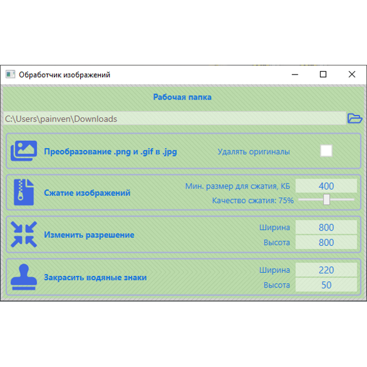

# ImageCompressor
## Программа для массовой обработки изображений

### Возможности

1. Преобразование изображений .png, .web, .gif в .jpg
2. Сжатие изображений подходящих под критерий (больше определенного размера)
3. Изменение размера изображений (для создания квадратных изображений, thumbnails)

